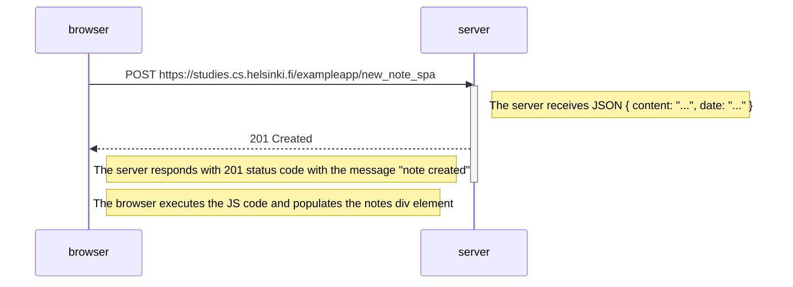

```mermaid
sequenceDiagram
    participant browser
    participant server

    browser->>server: POST https://studies.cs.helsinki.fi/exampleapp/new_note_spa
    activate server
    Note right of server: The server receives JSON { content: "...", date: "..." }
    server-->>browser: 201 Created
    Note left of server: The server responds with 201 status code with the message "note created"
    deactivate server


    Note right of browser: The browser executes the JS code and populates the notes div element
```